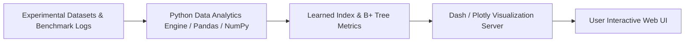

# Interactive Benchmarking Dashboard: Learned Database Indexes vs B+ Tree

[](https://www.python.org/)
[](https://plotly.com/)
[](https://plotly.com/)
[](https://getbootstrap.com/)
[](https://www.tensorflow.org/)

A research-grade, interactive analytics dashboard built with **Dash**, **Plotly**, and **Bootstrap** to visualize, evaluate, and compare performance benchmarks between **Hybrid Learned Indexes (RMI)** and traditional **B+ Tree** data structures.

## Overview

Learned database indexes promise significant memory savings and faster lookup times over traditional search trees. However, analyzing their performance requires evaluating multiple trade-offs: build time vs. lookup latency, model error bounds vs. array size, and memory footprint.

**`dash_UI`** provides an intuitive analytical frontend that presents real-time and offline experimental results across varied key distributions (Uniform, Normal, Lognormal, Real-World Maps).

## Key Features

* **Comparative Metric Analytics**: Interactive visualizations comparing Lookup Latency ($\mu\text{s}$), Build Time (s), Index Size (KB/MB), and Error Residuals.
* **Dynamic Distribution Controls**: Filter benchmark results by dataset size ($N=10^4 \dots 10^7$) and key distributions.
* **Interactive Charting**: Built with Plotly for responsive zooming, panning, hover inspections, and high-resolution chart export.
* **Hardware & Resource Profiling**: Displays CPU and Memory utilization metrics captured via `psutil`.

## Architecture



## Tech Stack

* **Frontend & Visualization Framework**: Dash 2.14.2, Plotly 5.18.0, Dash Bootstrap Components 1.5.0
* **Data Processing & Analytics**: Pandas 2.0.3, NumPy 1.24.3, TensorFlow 2.14.0
* **System Metrics**: `psutil` 5.9.6
* **Language**: Python 3.10+

## Project Structure

```text
dash_UI/
├── app.py             # Main Dash Application Layout & Callback Server
├── config.py          # Dashboard Configuration & Color Palette Tokens
├── requirements.txt   # Python Dependencies
├── QUICKSTART.md      # Detailed Quickstart Guide
└── README.md
```

## Quickstart

### 1. Clone & Install
```bash
git clone https://github.com/SAfiyanRafi/dash_UI.git
cd dash_UI

python -m venv venv
# Windows PowerShell:
.\venv\Scripts\Activate.ps1
# Linux/macOS:
source venv/bin/activate

pip install -r requirements.txt
```

### 2. Launch Dashboard Server
```bash
python app.py
```

Open your browser and navigate to `http://127.0.0.1:8050` to interact with the dashboard.

## Screenshots / Demo

> Add application screenshots demonstrating the main benchmarking view, lookup latency comparisons, and memory utilization breakdowns.

## Related Projects

* **[`Learned_database_indexes`](https://github.com/SAfiyanRafi/Learned_database_indexes)**: The underlying PyTorch & Python ML research codebase generating these index benchmarks.

## License

This project is open source under the [MIT License](LICENSE).
